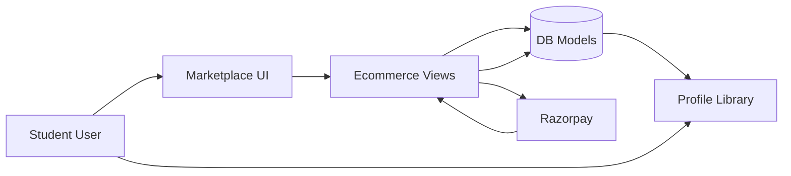
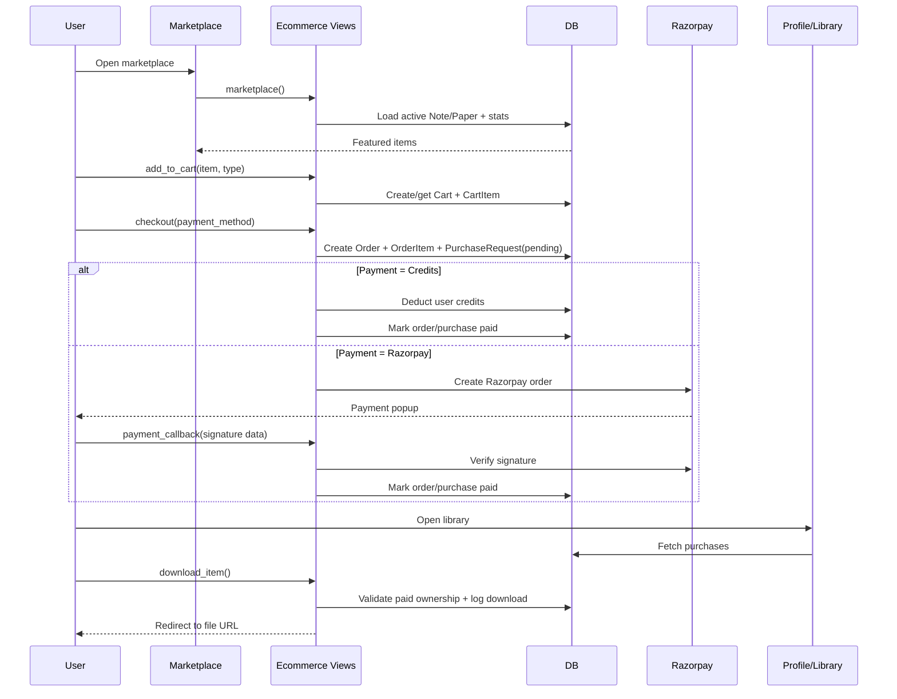

# StudyPedia Marketplace Workflow (Short Architecture)

## 1) Architecture Overview

StudyPedia marketplace follows a standard Django layered flow:

- **Presentation layer (templates)**:
  - Marketplace listing: `ecommerce/templates/ecommerce/marketplace.html`
  - Cart + checkout UI: `ecommerce/templates/ecommerce/cart.html`, `ecommerce/templates/ecommerce/checkout.html`
  - User library/download UI: `accounts/templates/accounts/profile.html`

- **Application layer (views/controllers)**:
  - `marketplace()` shows featured Notes/Papers + stats
  - `add_to_cart()`, `cart_view()`, `checkout()` handle buy flow
  - `payment_callback()` confirms Razorpay payments
  - `download_item()` validates ownership and serves file

- **Domain/data layer (models)**:
  - Content: `Note`, `Paper` (price, credits, pdf_file, is_active)
  - Commerce: `Cart`, `CartItem`, `Order`, `OrderItem`, `Coupon`, `PurchaseRequest`, `DownloadLog`
  - User: `User` with `credits`

- **Payment layer**:
  - **Credits**: immediate success if enough user credits
  - **Razorpay**: create order, verify signature in callback, mark paid

## 2) High-Level Diagram

## 3) Buy + Download Workflow

## 4) Current Important Notes

- Purchase access is controlled by paid records (`OrderItem` / `PurchaseRequest`).
- Download is allowed only for paid users and writes a `DownloadLog`.
- Coupons are session based and applied during checkout.
- Admin commerce dashboard exists for order/coupon monitoring (`adminapp`).
